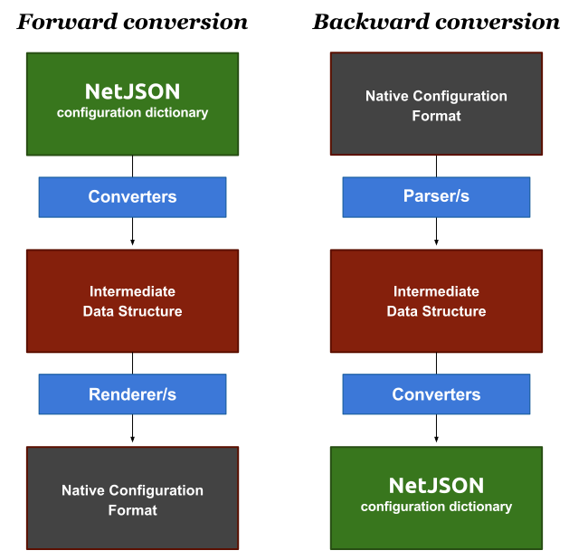

==============
Basic concepts
==============

.. include:: ../_github.rst

Before starting, let's quickly introduce the main concepts used in netjsonconfig:

* :ref:`configuration_dictionary`: python dictionary representing the configuration of a router
* :ref:`backend`: python class used to convert the *configuration dictionary* to the format used
  natively by a router firmware and vice versa
* :ref:`schema`: each backend has a `JSON-Schema <http://json-schema.org>`_ which
  defines the useful configuration options that the backend is able to process
* :ref:`validation`: the configuration is validated against its JSON-Schema before
  being processed by the backend
* :ref:`template`: common configuration options shared among routers (eg: VPNs, SSID)
  which can be passed to backends
* :ref:`multiple_templates`: possibility to inherit common configuration options
  from more than one template
* :ref:`context`: variables that can be referenced from the *configuration dictionary*

.. _configuration_dictionary:

NetJSON configuration dictionary
--------------------------------

*netjsonconfig* is an implementation of the `NetJSON <http://netjson.org>`_ format,
more specifically the ``DeviceConfiguration`` object, therefore to understand the
configuration format that the library uses to generate the final router configurations
it is essential to read at least the relevant `DeviceConfiguration section in the
NetJSON RFC <http://netjson.org/rfc.html#rfc.section.5>`_.

Here it is a simple *NetJSON DeviceConfiguration* object represented with a python dictionary:

.. code-block:: python

    {
        "type": "DeviceConfiguration",
        "general": {
            "hostname": "RouterA"
        },
        "interfaces": [
            {
                "name": "eth0",
                "type": "ethernet",
                "addresses": [
                    {
                        "address": "192.168.1.1",
                        "mask": 24,
                        "proto": "static",
                        "family": "ipv4"
                    }
                ]
            }
        ]
    }

The previous example describes a device named ``RouterA`` which has a single
network interface named ``eth0`` with a statically assigned ip address ``192.168.1.1/24``
(CIDR notation).

Because netjsonconfig deals only with ``DeviceConfiguration`` objects, the ``type`` attribute can be omitted.

The previous configuration object therefore can be shortened to:

.. code-block:: python

    {
        "general": {
            "hostname": "RouterA"
        },
        "interfaces": [
            {
                "name": "eth0",
                "type": "ethernet",
                "addresses": [
                    {
                        "address": "192.168.1.1",
                        "mask": 24,
                        "proto": "static",
                        "family": "ipv4"
                    }
                ]
            }
        ]
    }

From now on we will use the term *configuration dictionary* to refer to
*NetJSON DeviceConfiguration* objects.

.. _backend:

Backend
-------

A backend is a python class used to convert the *configuration dictionary* to the format used
natively by the router (forward conversion, from NetJSON to native) and vice versa (backward conversion,
from native to NetJSON), each supported firmware or opearting system will have its own backend
and third parties can write their own custom backends.

The current implemented backends are:

 * :doc:`OpenWrt </backends/openwrt>`
 * :doc:`OpenWisp </backends/openwisp>` (based on the ``OpenWrt`` backend)
 * :doc:`OpenVpn </backends/openvpn>` (custom backend implementing only OpenVPN configuration)
 * :doc:`WireGuard </backends/wireguard>` (custom backend implementing only WireGuard configuration)
 * :doc:`VXLAN over WireGuard </backends/vxlan_over_wireguard>` (custom backend implementing only VXLAN over WireGuard configuration)

Example initialization of ``OpenWrt`` backend:

.. code-block:: python

    from netjsonconfig import OpenWrt

    ipv6_router = OpenWrt({
        "interfaces": [
            {
                "name": "eth0.1",
                "type": "ethernet",
                "addresses": [
                    {
                        "address": "fd87::1",
                        "mask": 128,
                        "proto": "static",
                        "family": "ipv6"
                    }
                ]
            }
        ]
    })

Each backend will implement **parsers**, **renderers** and **converters** to accomplish its
configuration generation or parsing goals.

The process is best explained with the following diagram:

**Converters** take care of converting between *NetJSON* and the intermediate data structure
(and vice versa).

**Renderers** take care of rendering the intermediate data structure to the native format.

**Parsers** perform the opposite operation of ``Renderers``: they take care of parsing native format and
build the intermediate data structure.

.. _schema:

Schema
------

Each backend has a JSON-Schema, all the backends have a schema which is derived
from the same parent schema, defined in ``netjsonconfig.backends.schema``
(`view source <https://github.com/openwisp/netjsonconfig/blob/master/netjsonconfig/schema.py>`_).

Since different backends may support different features each backend may extend its
schema by adding custom definitions.

.. _validation:

Validation
----------

All the backends have a ``validate`` method which is called automatically before
trying to process the configuration.

If the passed configuration violates the schema the ``validate`` method will raise
a ``ValidationError``.

An instance of validation error has two public attributes:

* ``message``: a human readable message explaining the error
* ``details``: a reference to the instance of ``jsonschema.exceptions.ValidationError``
  which contains more details about what has gone wrong;
  for a complete reference see the `python-jsonschema documentation <https://python-jsonschema.readthedocs.org/en/latest/errors/#handling-validation-errors>`_

You may call the ``validate`` method in your application arbitrarily, eg: before
trying to save the *configuration dictionary* into a database.

.. _template:

Template
--------

If you have devices with very similar *configuration dictionaries* you can store the shared
blocks in one or more reusable templates which will be used as a base to build
the final configuration.

Combining different templates
~~~~~~~~~~~~~~~~~~~~~~~~~~~~~

Let's illustrate this with a practical example, we have two devices:

 * Router1
 * Router2

Both devices have an ``eth0`` interface in DHCP mode; *Router2* additionally has
an ``eth1`` interface with a statically assigned ipv4 address.

The two routers can be represented with the following code:

.. code-block:: python

    from netjsonconfig import OpenWrt

    router1 = OpenWrt({
        "general": {"hostname": "Router1"}
        "interfaces": [
            {
                "name": "eth0",
                "type": "ethernet",
                "addresses": [
                    {
                        "proto": "dhcp",
                        "family": "ipv4"
                    }
                ]
            }
        ]
    })

    router2 = OpenWrt({
        "general": {"hostname": "Router2"},
        "interfaces": [
            {
                "name": "eth0",
                "type": "ethernet",
                "addresses": [
                    {
                        "proto": "dhcp",
                        "family": "ipv4"
                    }
                ]
            },
            {
                "name": "eth1",
                "type": "ethernet",
                "addresses": [
                    {
                        "address": "192.168.1.1",
                        "mask": 24,
                        "proto": "static",
                        "family": "ipv4"
                    }
                ]
            }
        ]
    })

The two *configuration dictionaries* share the same settings for the ``eth0``
interface, therefore we can make the ``eth0`` settings our template and
refactor the previous code as follows:

.. code-block:: python

    from netjsonconfig import OpenWrt

    dhcp_template = {
        "interfaces": [
            {
                "name": "eth0",
                "type": "ethernet",
                "addresses": [
                    {
                        "proto": "dhcp",
                        "family": "ipv4"
                    }
                ]
            }
        ]
    }

    router1 = OpenWrt(config={"general": {"hostname": "Router1"}},
                      templates=[dhcp_template])

    router2_config = {
        "general": {"hostname": "Router2"},
        "interfaces": [
            {
                "name": "eth1",
                "type": "ethernet",
                "addresses": [
                    {
                        "address": "192.168.1.1",
                        "mask": 24,
                        "proto": "static",
                        "family": "ipv4"
                    }
                ]
            }
        ]
    }
    router2 = OpenWrt(router2_config, templates=[dhcp_template])

Overriding a template
~~~~~~~~~~~~~~~~~~~~~

In many occasions you may want to define a general template which can be overridden in some specific occasions.

A common use case is to define a general radio template and override its channel on certain access points:

.. code-block:: python

    from netjsonconfig import OpenWrt

    general_radio_template = {
        "radios": [
            {
                "name": "radio0",
                "phy": "phy0",
                "protocol": "802.11n",
                "driver": "mac80211",
                "channel": 0,  # zero means "auto"
                "channel_width": 20,
                "country": "US",
                "disabled": False
            }
        ]
    }

    specific_radio_config = {
        "radios": [
            {
                "name": "radio0",
                "channel": 10,
            }
        ]
    }

    router1 = OpenWrt(config=specific_radio_config,
                      templates=[general_radio_template])

    print(router1.render())

Will generater the following output::

    package wireless

    config wifi-device 'radio0'
            option channel '10'
            option country 'US'
            option disabled '0'
            option htmode 'HT20'
            option hwmode '11g'
            option phy 'phy0'
            option type 'mac80211'

.. _multiple_templates:

Multiple template inheritance
-----------------------------

You might have noticed that the ``templates`` argument is a list; that's because
it's possible to pass multiple templates that will be added one on top of the
other to build the resulting *configuration dictionary*, allowing to reduce or
even eliminate repetitions.

.. note::
    When using multiple templates, their order is important.
    Templates that are specified afterwards override the ones that come first.

    To understand this, read the section :ref:`multiple_overrides`.

.. _multiple_overrides:

Multiple overrides
~~~~~~~~~~~~~~~~~~

Here's a more complex example involving multiple overrides:

.. code-block:: python

    from netjsonconfig import OpenWrt

    general_radio_template = {
        "radios": [
            {
                "name": "radio0",
                "phy": "phy0",
                "protocol": "802.11n",
                "driver": "mac80211",
                "channel": 0,  # zero means "auto"
                "channel_width": 20,
                "country": "00",  # world
                "disabled": False
            }
        ]
    }

    united_states_radio_template = {
        "radios": [
            {
                "name": "radio0",
                "country": "US"
            }
        ]
    }

    specific_radio_config = {
        "radios": [
            {
                "name": "radio0",
                "channel": 10,
            }
        ]
    }

    router1 = OpenWrt(config=specific_radio_config,
                      templates=[general_radio_template,
                                 united_states_radio_template])

    print(router1.render())

Will generater the following output::

    package wireless

    config wifi-device 'radio0'
            option channel '10'
            option country 'US'
            option disabled '0'
            option htmode 'HT20'
            option hwmode '11g'
            option phy 'phy0'
            option type 'mac80211'

Implementation details
~~~~~~~~~~~~~~~~~~~~~~

The functions used under the hood to merge configurations and templates
are ``netjsonconfig.utils.merge_config`` and ``netjsonconfig.utils.merge_list``:

.. autofunction:: netjsonconfig.utils.merge_config

.. autofunction:: netjsonconfig.utils.merge_list

.. _context:

Context (configuration variables)
---------------------------------

Without variables, many bits of configuration cannot be stored in templates, because some
parameters are unique to the device, think about things like a *UUID* or a public ip address.

With this feature it is possible to reference variables in the *configuration dictionary*,
these variables will be evaluated when the configuration is rendered/generated.

Here's an example from the real world, pay attention to the two variables,
``{{ UUID }}`` and ``{{ KEY }}``:

.. code-block:: python

    from netjsonconfig import OpenWrt

    openwisp_config_template = {
        "openwisp": [
            {
                "config_name": "controller",
                "config_value": "http",
                "url": "http://controller.examplewifiservice.com",
                "interval": "60",
                "verify_ssl": "1",
                "uuid": "{{ UUID }}",
                "key": "{{ KEY }}"
            }
        ]
    }

    context = {
        'UUID': '9d9032b2-da18-4d47-a414-1f7f605479e6',
        'KEY': 'xk7OzA1qN6h1Ggxy8UH5NI8kQnbuLxsE'
    }

    router1 = OpenWrt(config={"general": {"hostname": "Router1"}},
                      templates=[openwisp_config_template],
                      context=context)

Let's see the result with:

.. code-block:: python

    >>> print(router1.render())
    package system

    config system
            option hostname 'Router1'
            option timezone 'UTC'
            option zonename 'UTC'

    package openwisp

    config controller 'http'
            option interval '60'
            option key 'xk7OzA1qN6h1Ggxy8UH5NI8kQnbuLxsE'
            option url 'http://controller.examplewifiservice.com'
            option uuid '9d9032b2-da18-4d47-a414-1f7f605479e6'
            option verify_ssl '1'

.. warning::
    **When using variables, keep in mind the following rules**:

     * variables must be written in the form of ``{{ var_name }}`` or ``{{var_name}}``;
     * variable names can contain only alphanumeric characters and underscores;
     * unrecognized variables will be ignored;

Project goals
-------------

If you are interested in this topic you can read more about the
:doc:`Goals and Motivations <./goals>` of this project.

Support
-------

See `OpenWISP Support Channels <http://openwisp.org/support.html>`_.

License
-------

This software is licensed under the terms of the GPLv3 license,
for more information, please see full `LICENSE
<https://github.com/openwisp/netjsonconfig/blob/master/LICENSE>`_ file.
